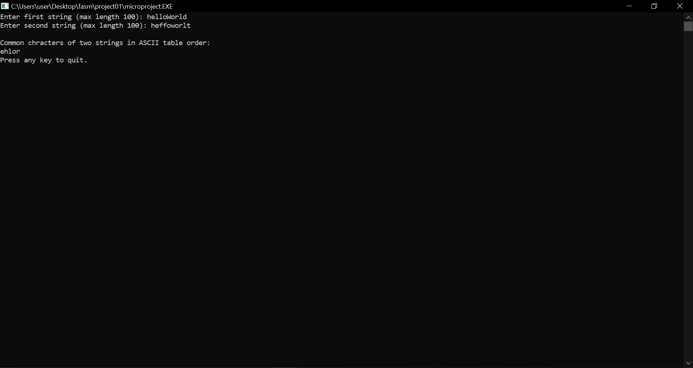
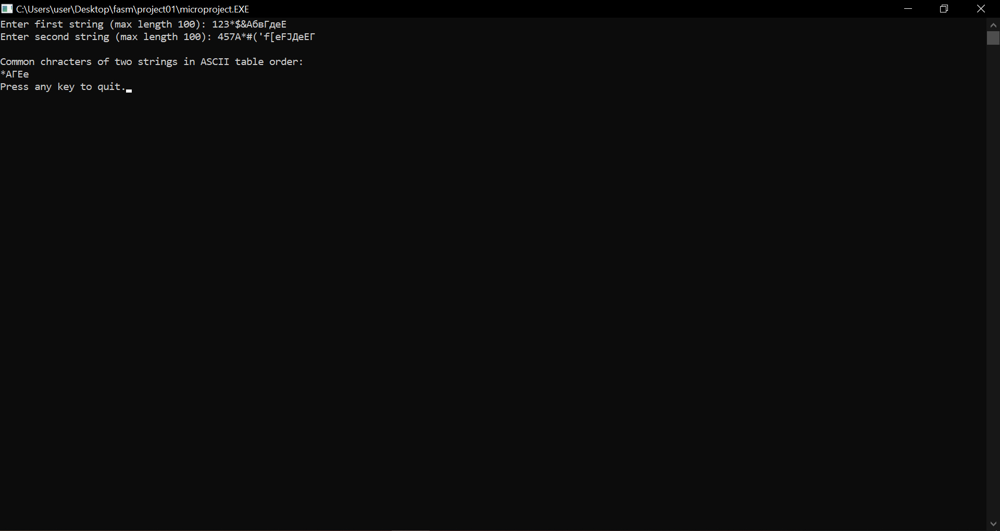
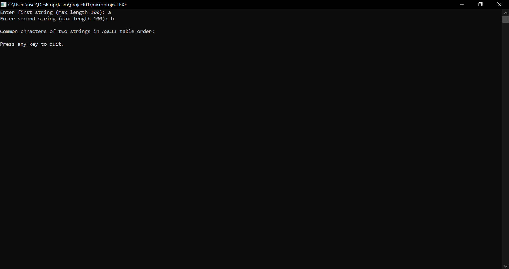
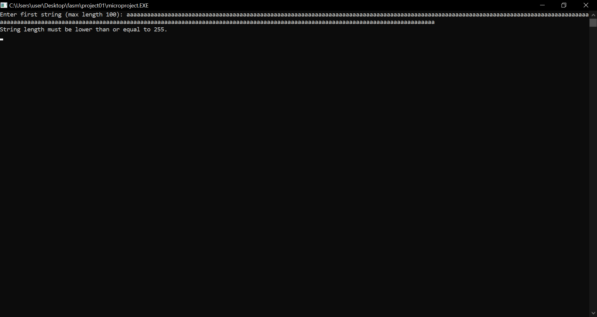

# project01

## Задание

Разработать программу, определяющую список одинаковых символов, содержащихся в двух заданных ASCII строках.

## Алгоритм

Шаги алгоритма для нахождения списка одинаковых символов в строках:
1. Создать массив been1[256] и been2[256] для определения символов встречающихся в первой и второй строке соответственно.
2. Заполнить массивы, пройдя по строкам так, что для символа s, принадлежащего строке been[s] = <количество появлений этого символа в троке>.
3. Пройтись по массивам been1[] и been2[] и вывести каждый символ, для которого соответствующее значение в обоих массивах больше нуля.

## Использованные источники

1. Руководство программиста Flat Assembler: https://flatassembler.net/docs.php?article=manual
2. Материал курса «Архитектура вычислительных систем»: http://www.softcraft.ru/edu/comparch/practice/asm86/06-str
3. Сайт, посвященный программированию на языках низкого уровня:
http://av-assembler.ru/

## Тесты

test 1

test 2

test 3

test 4

