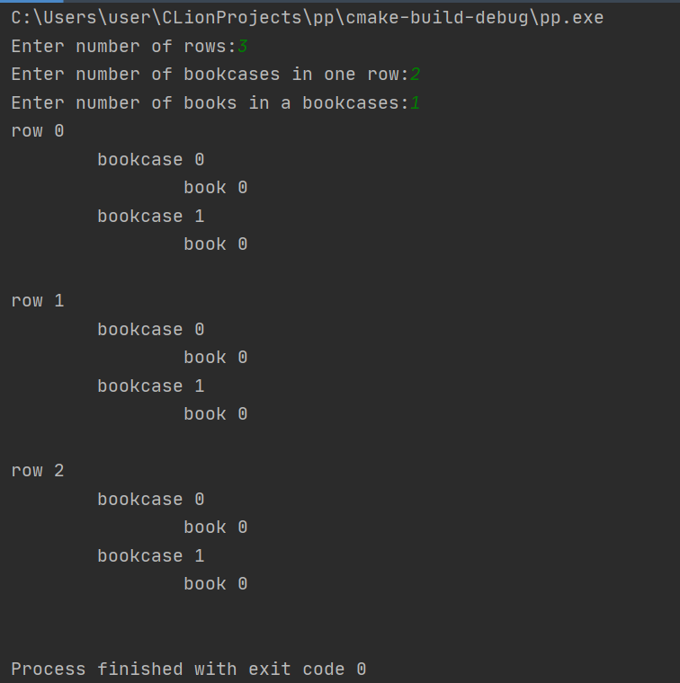
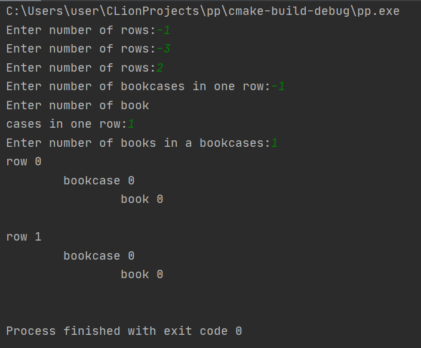

# task03

## Задание

Задача об инвентаризации по рядам. После нового года в библиотеке университета обнаружилась пропажа каталога. После поиска и наказания виноватых, ректор дал указание восстановить каталог силами студентов. Фонд библиотека представляет собой прямоугольное помещение, в котором находится M рядов по N шкафов по K книг в каждом шкафу. Требуется создать многопоточное приложение, составляющее каталог. При решении задачи использовать метод «портфель задач», причем в качестве отдельной задачи задается составление каталога одним студентом для одного ряда.

## Алгоритм

Приложение использует модель «Взаимодействующие равные» со способом распределения работ «портфель задач».
При такой модели каждый поток сначала берет доступную задачу, получая некоторый номер, указывающий на неё, через глобальную переменную, выполняет её и добавляет результат в массив (вектор), а после, если ещё остались невыполненные задачи , повторяет процесс.
Для разделения доступа к данным, в данном случае к глобальной переменной, содержащей номер доступного для выполнения задания, используется мьютекс.

## Использованные источники

1. Парадигмы параллельного программирования:
https://pro-prof.com/forums/topic/parallel-programming-paradigms 
2. Уильямс Энтони. C++. Практика многопоточного программирования. — СПб.: Питер, 2020. — 640 с.

## Тесты

test 1

test 2

